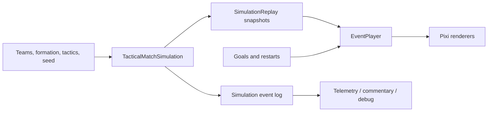

# Simulation architecture

`TacticalMatchSimulation` is pure simulation state. It runs with a 100 ms step and never references the DOM or Pixi. It contains players in metres, ball position/flight, possession, tactical phase and deterministic decision state.

`SimulationReplay` precomputes a bounded sequence of snapshots and interpolates them for arbitrary visual time. This allows the renderer to remain frame-rate independent. `EventPlayer` uses these snapshots in normal play and keeps the existing timeline only for explicit goals and set pieces.

The temporary result boundary remains `engine.js -> main.js -> partido2d.js`. The next migration moves score generation behind the tactical core without changing tournament consumers.
